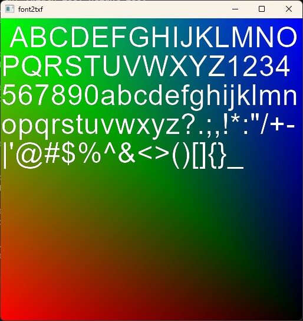

# font2txf

**font2txf** is an utility used for generating texture mapped font files,
also known as the `TXF` format, from a **TrueType** (`TTF`) or **OpenType**
(`OTF`) font file.

`TXF` is a texture font which can be used in the context of **GLUT** (OpenGL
Utility Toolkit), created by [Mark J. Kilgard](https://en.wikipedia.org/wiki/Mark_Kilgard).
For the **Sega Dreamcast**, the `TXF` format is supported using the `libdcplib`
KallistiOS Port, using the `PLIB FNT` component. An example of source code,
including sample `TXF` fonts, is available in this example:

	$KOS_BASE/examples/dreamcast/cpp/dcplib

For generating `TXF` files, you can use the provided `gentexfont` (originally
written by Mark himself), `ttf2txf` (from the [Celestia](https://celestiaproject.space/) 
project) or this `font2txf` utility.

Below you'll find an example of a `TXF` generated font, from the `Arial`
TrueType font:

## Building

This program is a standard C program which may be compiled with **GNU Make**.
It requires `FreeType` installed.
[Learn more about FreeType here](http://freetype.org/).

1. Edit the `Makefile.cfg` and check if everything is OK for you;
2. Enter `make` (`gmake` on BSD systems).

If you want to enable the **Preview** feature (as displayed in this 
`README` file), you will have to install `freeglut`. 
[Learn more about freeglut here](https://freeglut.sourceforge.net/).

## Usage

To use this tool

Default charset to convert (see `-c` or `-f` options below): 
  (space)(A..Z)1234567890(a..z)?.;,!*:"/+-|'@#$%^&<>()[]{}_

Available options are (displayed with the `-h` switch):

    -w <width>         Texture width (default: 256)
    -e <height>        Texture height (default: 256); also `-h` for compatibility
    -c <string>        Override charset to convert; read from command-line
                        Cannot be mixed with `-f`
    -f <filename.txt>  Override charset to convert; read from a text file
                        Cannot be mixed with `-c`
    -g <gap>           Space between glyphs (default: 1)
    -s <size>          Font point size (default: 20)
    -o <filename.txf>  Output file for textured font (default: <fontfile>.txf)
    -q                 Quiet; except error messages, cannot be mixed with `-v`
    -v                 Verbose; display more info, cannot be mixed with `-q`
    -p                 Preview; display the txf output at the end of the process
    -h                 Usage information (you're looking at it); if `-w` not set

Example of a command-line:

	./ttf2txf -o revenant.txf -s 22 -w 256 -h 256 -c "0123456789abcdefghijklmnopqrstuvwxyzABCDEFGHIJKLMNOPQRSTUVWXYZ!@#$%^&*()-_=+[]{}|;:,.<>~ ?/" revenant.ttf

The `revenant.txf` file will be generated from the `revenant.ttf` font,
in a `256x256` texture, using the charset passed with the `-c` switch, 
and using the `22pt` size.

## Useful links

* [A Simple OpenGL-based API for Texture Mapped Text](http://sgifiles.irixnet.org/sgi/opengl/contrib/mjk/tips/TexFont/TexFont.html)
* [Building .txf font texture files for the Celestia project](https://en.wikibooks.org/wiki/Celestia/Internationalization#Building_.txf_font_texture_files)
* [Online Celestia Font Texture Generator](http://web.archive.org/web/20080413101857/http://celestia.teyssier.org/ttf2txf/index.html)
* [OpenGL GLUT (The OpenGL Utility Toolkit) Examples](https://www.opengl.org/archives/resources/code/samples/glut_examples/texfont/texfont.html)

## Acknowledgments

* [Mark J. Kilgard](https://github.com/markkilgard): Creator of
  the Texture Mapped Font (TXF) format.
* [Chris Laurel](https://www.fifthstarlabs.com/chris) and the
  [Celestia project team](https://celestiaproject.space/): 
  The initial authors of the original 
  [ttf2txf](https://web.archive.org/web/20051104023112/http://www.shatters.net/~claurel/celestia/fonts/tt2txf/)
  utility.
* Mickaël Cardoso ([SiZiOUS](http://sizious.com/)): Complete refactoring of the project.

## License

This project is licensed under the **GNU GPL 2 License** - see
the [LICENSE](LICENSE) file for details.
